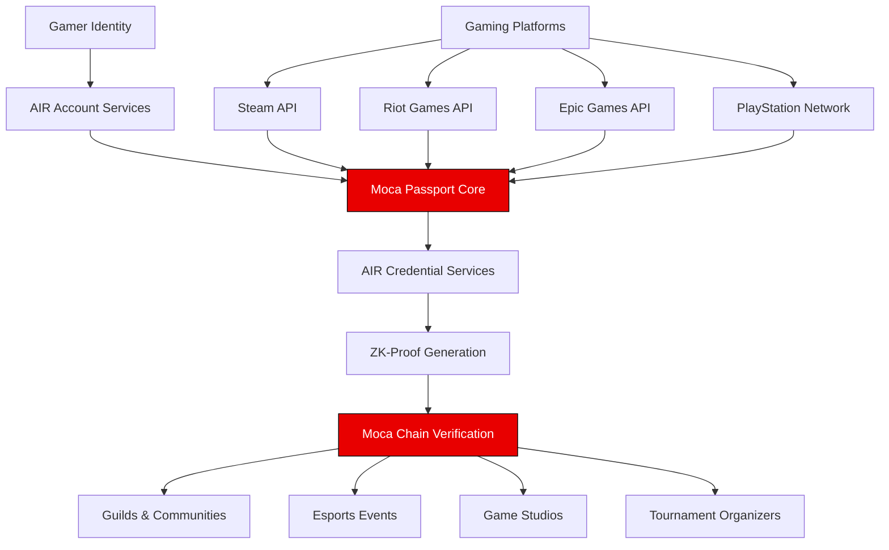
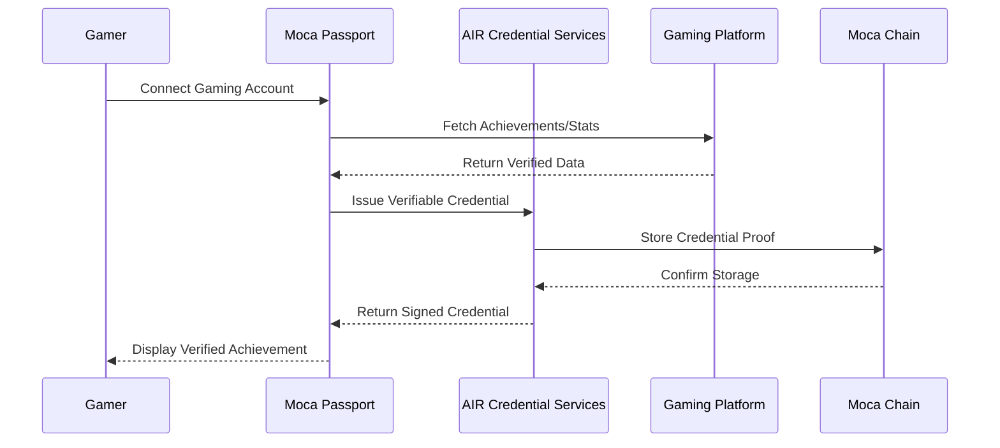
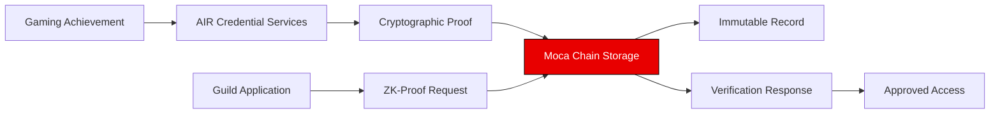

# Moca Passport

**The Universal Gamer Credential - Revolutionizing Gaming Identity**

A groundbreaking, privacy-preserving, decentralized gaming identity platform that unifies fragmented gaming achievements into a single, verifiable, portable credential system powered by the Moca Stack.

## Vision Statement

Moca Passport represents the next evolution of gaming identity - a paradigm shift from platform-locked achievements to a universal, user-owned credential system that revolutionizes how gamers prove skill, build reputation, and connect with communities across the entire gaming ecosystem.

## Architecture Overview



## Revolutionary Features

### Decentralized Gaming Identity Revolution
Moca Passport creates the first truly user-owned gaming identity that transcends platform boundaries, eliminating the fragmentation that has plagued the gaming industry for decades.

### Cross-Platform Achievement Unification
Our system automatically aggregates and verifies achievements, rankings, and accomplishments from every major gaming platform, creating a comprehensive skill and reputation profile that follows gamers everywhere.

### Privacy-Preserving Zero-Knowledge Verification
Leveraging cutting-edge cryptographic techniques, gamers can prove their credentials without exposing sensitive personal data, revolutionizing trust in gaming communities.

### Social Reputation Layer
A peer-to-peer endorsement system that captures the intangible qualities that make great teammates - communication, leadership, and sportsmanship - creating a holistic gaming reputation.

## Moca Stack Integration

### AIR Account Services Integration
**Status**: Fully Implemented (`/auth`, `hooks/useAirKit.ts`)

Our AIR Account Services integration provides:
- Seamless SSO authentication across the Animoca ecosystem
- Wallet-based identity management for true ownership
- Cross-platform compatibility with existing Web3 infrastructure
- Secure key management and identity verification

```typescript
// AIR Account Services Flow
User Authentication → Identity Creation → Credential Binding → Cross-Platform Access
```

### AIR Credential Services Implementation
**Status**: Work in Progress - Core Infrastructure

AIR Credential Services powers the revolutionary credential system:



**Key Capabilities**:
- Automated credential issuance for gaming achievements
- Cryptographically signed proof of accomplishments
- Tamper-proof credential verification
- Interoperable credential format across Moca ecosystem
- Real-time achievement validation and updates

### Moca Chain Integration
**Status**: Work in Progress - Blockchain Infrastructure

Moca Chain serves as the decentralized backbone ensuring:

**Immutable Credential Registry**
- Permanent, tamper-proof storage of achievement proofs
- Prevention of duplicate or fraudulent credentials
- Cross-game interoperability within Animoca ecosystem

**Sybil Attack Prevention**
- Unique identity verification across all platforms
- Prevention of multi-account exploitation
- Robust anti-cheating mechanisms

**Decentralized Verification Network**
- Distributed consensus on credential validity
- Community-driven reputation scoring
- Trustless verification for tournaments and events



## Current Implementation Status

### Production Ready
- **Authentication System**: Full AIR Account Services integration
- **User Interface**: Modern, professional gaming-focused design
- **Core Navigation**: Dashboard, Guilds, Privacy management pages

### In Active Development
- **AIR Credential Services**: Automated achievement credential issuance
- **Moca Chain Integration**: Decentralized credential storage and verification
- **Gaming Platform APIs**: Steam, Riot Games, Epic, PlayStation integration
- **ZK-Proof System**: Privacy-preserving credential sharing

### Roadmap Features
- **IRL Event Integration**: Tournament and esports event verification
- **Advanced Analytics**: Cross-game performance insights
- **Mobile Application**: Native iOS/Android experience

## Technical Architecture

### Frontend Stack
```
Next.js 14 + TypeScript
├── AIR Account Services SDK
├── AIR Credential Services SDK
├── Moca Chain Integration Layer
├── Gaming Platform API Connectors
└── Zero-Knowledge Proof Libraries
```

### Backend Infrastructure
```
Moca Stack Services
├── Decentralized Identity Management
├── Credential Issuance Engine
├── Cross-Platform Data Aggregation
├── ZK-Proof Generation
└── Blockchain State Management
```

## Getting Started

### Prerequisites
- Node.js 18+
- Moca Stack SDK access
- Gaming platform API credentials

### Installation

```bash
git clone [repository-url]
cd moca-passport
npm install
```

### Environment Configuration
```bash
# AIR Account Services
NEXT_PUBLIC_AIR_ACCOUNT_API_KEY=your_api_key
NEXT_PUBLIC_AIR_CREDENTIAL_ENDPOINT=your_credential_endpoint

# Moca Chain Configuration
NEXT_PUBLIC_MOCA_CHAIN_RPC=your_rpc_endpoint
NEXT_PUBLIC_MOCA_CHAIN_NETWORK=your_network_id

# Gaming Platform APIs
STEAM_API_KEY=your_steam_key
RIOT_API_KEY=your_riot_key
EPIC_CLIENT_ID=your_epic_client_id
```

### Development Server
```bash
npm run dev
# Application available at http://localhost:3000
```

## Project Structure

```
moca-passport/
├── pages/
│   ├── auth/              # AIR Account Services integration
│   ├── dashboard/         # Unified gaming profile
│   ├── guilds/           # Community reputation system
│   ├── privacy/          # ZK-proof credential management
│   └── credentials/      # AIR Credential Services interface
├── hooks/
│   ├── useAirKit.ts      # AIR Account Services hook
│   ├── useCredentials.ts # AIR Credential Services hook
│   └── useMocaChain.ts   # Moca Chain integration hook
├── services/
│   ├── platforms/        # Gaming platform integrations
│   ├── credentials/      # Credential management logic
│   └── blockchain/       # Moca Chain interactions
└── components/           # Reusable UI components
```

## Game-Changing Use Cases

### For Individual Gamers
- **Universal Skill Recognition**: Achievements from any platform contribute to overall gaming reputation
- **Privacy-Protected Applications**: Join guilds and tournaments without exposing personal information
- **Cross-Game Reputation**: Leadership in one game translates to recognition in others

### For Game Studios & Publishers
- **Anti-Cheat Integration**: Leverage verified gaming history to identify suspicious accounts
- **Player Onboarding**: Fast-track experienced players with proven track records
- **Community Building**: Connect with players who have demonstrated positive social behaviors

### For Esports & Communities
- **Automated Recruitment**: Filter candidates based on verified skill and reputation criteria
- **Tournament Integrity**: Ensure participant authenticity without manual verification
- **Fair Play Enforcement**: Track cross-platform behavior patterns

## Competitive Advantages

### Technical Innovation
- First implementation of ZK-proofs in gaming credential verification
- Seamless integration with Animoca's ecosystem of 400+ portfolio companies
- Quantum-resistant cryptographic credential storage

### Market Position
- Solves the $200B+ gaming industry's identity fragmentation problem
- Enables new business models for game studios and esports organizations
- Creates network effects that strengthen with each connected platform

### User Experience
- One-click guild applications replacing lengthy verification processes
- Automatic reputation building across all gaming activities
- Privacy-first approach that puts users in control of their data

## Demo & Deployment

**Live Application**: [Deployment URL]
**Demo Video**: [Comprehensive Feature Walkthrough]
**Technical Documentation**: [API Reference & Integration Guides]

## Future Vision

Moca Passport will become the de facto standard for gaming identity verification, enabling:
- Seamless cross-metaverse experiences
- AI-powered skill matching and team formation
- Integration with real-world gaming venues and tournaments
- Foundation for Web3 gaming economies within the Moca ecosystem

## Contributing

Join the revolution in gaming identity. We welcome contributions from developers, gamers, and innovators who share our vision of a unified, user-owned gaming identity ecosystem.

---

**Moca Passport** - Redefining Gaming Identity for the Decentralized Era