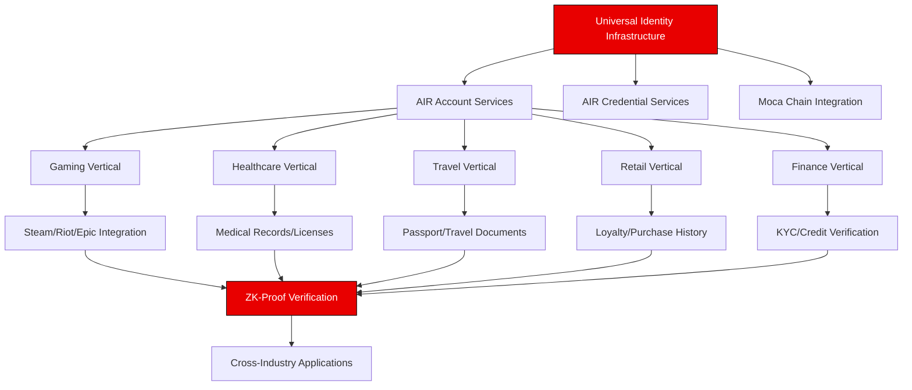
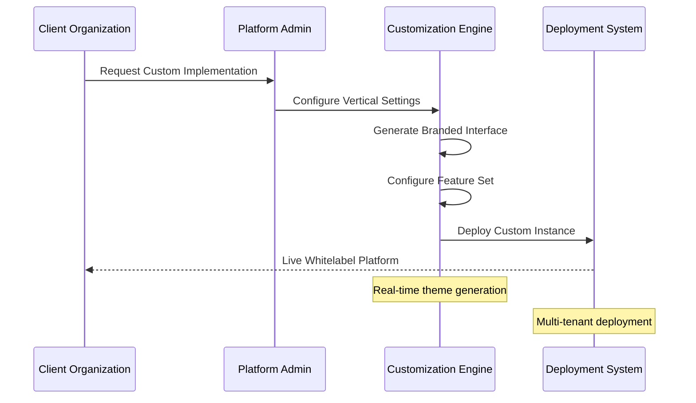
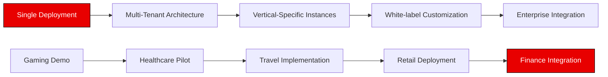

# Moca Passport - Universal Identity Infrastructure Platform

**One Platform, Infinite Possibilities - Whitelabelable Identity Solutions Across All Industries**

A revolutionary, privacy-preserving, multi-vertical identity infrastructure that enables organizations across any industry to deploy customized credential management systems. Built on the Moca Stack, this platform demonstrates the future of decentralized identity with gaming as the flagship vertical showcase.

## Platform Vision

Moca Passport represents a paradigm shift from single-purpose identity solutions to a universal infrastructure layer that adapts to any industry's unique requirements while maintaining the highest standards of privacy, security, and user ownership.

## Universal Architecture



## Multi-Vertical Capabilities

### Gaming (Primary Demo - Fully Implemented)
**Industry Focus**: Gaming communities, esports, game studios
**Key Features**:
- Cross-platform achievement aggregation (Steam, Riot, Epic, PSN)
- Guild membership and tournament verification
- Peer endorsement and reputation systems
- Anti-cheat and sybil attack prevention
- Privacy-preserving skill verification

### Healthcare (Infrastructure Ready)
**Industry Focus**: Medical practitioners, patients, healthcare institutions
**Key Capabilities**:
- Medical license and certification verification
- Patient consent and privacy management
- Treatment history and outcome tracking
- HIPAA-compliant credential sharing
- Provider network verification

### Travel & Hospitality (Infrastructure Ready)
**Industry Focus**: Airlines, hotels, travel agencies, government
**Key Capabilities**:
- Digital passport and visa verification
- Loyalty program integration across brands
- Travel history and preference management
- Secure document sharing with authorities
- Real-time identity verification at checkpoints

### Retail & E-commerce (Infrastructure Ready)
**Industry Focus**: Retailers, brands, marketplaces, consumers
**Key Capabilities**:
- Customer loyalty and rewards tracking
- Product authenticity verification
- Purchase history and preferences
- Brand reputation and review systems
- Fraud prevention and customer verification

### Financial Services (Infrastructure Ready)
**Industry Focus**: Banks, fintech, investment firms, regulators
**Key Capabilities**:
- KYC/AML compliance automation
- Credit history and scoring verification
- Investment qualification and accreditation
- Cross-institutional transaction verification
- Regulatory reporting and audit trails

## Technical Infrastructure

### Core Platform Components

```typescript
interface UniversalPlatform {
  identity: IdentityManagement
  credentials: CredentialIssuance
  verification: ZKProofSystem
  customization: WhitelabelEngine
  compliance: RegulatoryFramework
  analytics: CrossVerticalInsights
}

interface VerticalConfiguration {
  id: VerticalId
  branding: BrandConfiguration
  features: FeatureSet[]
  integrations: ExternalAPI[]
  compliance: ComplianceRequirements[]
  workflow: CustomWorkflow[]
}
```

### Whitelabel Customization Engine



### AIR Stack Integration

#### AIR Account Services (Production Ready)
- **Location**: `/auth` page, `hooks/useAirKit.ts`
- **Capabilities**: Universal SSO, wallet integration, cross-vertical identity
- **Implementation**: Fully integrated authentication system
- **Multi-vertical Support**: Single identity across all industry verticals

#### AIR Credential Services (In Development)
- **Purpose**: Universal credential issuance and verification
- **Cross-Vertical Features**:
  - Industry-agnostic credential templates
  - Custom verification workflows
  - Automated compliance checking
  - Cross-platform credential portability

```typescript
// Universal credential issuance
interface UniversalCredential {
  type: 'achievement' | 'license' | 'document' | 'loyalty' | 'compliance'
  vertical: 'gaming' | 'healthcare' | 'travel' | 'retail' | 'finance'
  issuer: VerifiedEntity
  subject: UserIdentity
  claims: VerifiableClaims
  proof: ZKProof
  expiry?: Date
  revocable: boolean
}
```

#### Moca Chain Integration (In Development)
- **Universal Registry**: Cross-industry credential storage
- **Anti-Fraud System**: Sybil attack prevention across all verticals
- **Interoperability**: Seamless credential portability between industries
- **Compliance Audit**: Immutable audit trails for regulated industries

### Platform Scalability



## Current Implementation Status

### Production Infrastructure
- **Universal Authentication**: AIR Account Services fully integrated
- **Multi-Vertical UI Framework**: Responsive design system with industry themes
- **Gaming Demo**: Complete feature implementation as infrastructure showcase
- **Platform Architecture**: Scalable foundation for multiple verticals

### Active Development
- **AIR Credential Services**: Universal credential issuance system
- **Moca Chain Integration**: Cross-industry verification and anti-fraud
- **Whitelabel Engine**: Real-time customization and deployment tools
- **Compliance Framework**: Industry-specific regulatory requirements

### Vertical Implementation Status

| Vertical | Demo Status | Features | Customization | Integration Ready |
|----------|-------------|----------|---------------|-------------------|
| Gaming | 🚧 UI Mockup | Infrastructure | ✅ Theme Ready | 🚧 In Progress |
| Healthcare | 🚧 UI Mockup | Infrastructure | ✅ Theme Ready | 🚧 In Progress |
| Travel | 🚧 UI Mockup | Infrastructure | ✅ Theme Ready | 🚧 In Progress |
| Retail | 🚧 UI Mockup | Infrastructure | ✅ Theme Ready | 🚧 In Progress |
| Finance | 🚧 UI Mockup | Infrastructure | ✅ Theme Ready | 🚧 In Progress |

## Project Structure

```
moca-passport-universal/
├── pages/
│   ├── /                          # Universal infrastructure landing
│   ├── platform/            # Platform capabilities showcase
│   ├── solutions/                 # Industry-specific demonstrations
│   ├── demo/
│   │   ├── gaming/               # Full gaming implementation
│   │   ├── healthcare/           # Healthcare UI mockup
│   │   ├── travel/               # Travel UI mockup
│   │   ├── retail/               # Retail UI mockup
│   │   └── finance/              # Finance UI mockup
│   ├── integration/              # Developer guides and API docs
│   ├── auth/                     # Universal AIR authentication
│   └── api/                      # Multi-vertical API endpoints
├── hooks/
│   ├── useAirKit.ts             # AIR Account Services
│   ├── useCredentials.ts        # Universal credential management
│   ├── useVertical.ts           # Vertical switching and theming
│   └── useMocaChain.ts          # Blockchain integration
├── services/
│   ├── verticals/               # Industry-specific business logic
│   ├── credentials/             # Universal credential operations
│   ├── customization/           # Whitelabel customization engine
│   └── compliance/              # Industry compliance frameworks
├── components/
│   ├── universal/               # Cross-vertical components
│   ├── vertical-specific/       # Industry-customized components
│   └── whitelabel/              # Customization and theming
└── config/
    ├── verticals/               # Industry configurations
    ├── themes/                  # Industry-specific themes
    └── compliance/              # Regulatory frameworks
```

## Getting Started

### Prerequisites
- Node.js 18+
- Moca Stack SDK access
- Multi-vertical API credentials (optional for full demo)

### Installation

```bash
git clone [repository-url]
cd moca-passport-universal
npm install
```

### Environment Configuration

```bash
# AIR Account Services
NEXT_PUBLIC_AIR_ACCOUNT_API_KEY=your_api_key
NEXT_PUBLIC_AIR_CREDENTIAL_ENDPOINT=your_credential_endpoint

# Moca Chain Configuration
NEXT_PUBLIC_MOCA_CHAIN_RPC=your_rpc_endpoint
NEXT_PUBLIC_MOCA_CHAIN_NETWORK=your_network_id

# Gaming Vertical APIs (Full Demo)
STEAM_API_KEY=your_steam_key
RIOT_API_KEY=your_riot_key
EPIC_CLIENT_ID=your_epic_client

# Healthcare Vertical APIs (Future)
HEALTHCARE_API_KEY=your_healthcare_key
HIPAA_COMPLIANCE_TOKEN=your_compliance_token

# Travel Vertical APIs (Future)
IATA_API_KEY=your_iata_key
PASSPORT_VERIFICATION_KEY=your_verification_key

# Retail Vertical APIs (Future)
COMMERCE_API_KEY=your_commerce_key
LOYALTY_NETWORK_TOKEN=your_loyalty_token

# Finance Vertical APIs (Future)
BANKING_API_KEY=your_banking_key
KYC_PROVIDER_TOKEN=your_kyc_token
```

### Development

```bash
# Start universal platform
npm run dev

# Start with specific vertical focus
npm run dev:gaming
npm run dev:healthcare
npm run dev:travel
npm run dev:retail
npm run dev:finance
```

### Build Multi-Vertical Deployment

```bash
# Build universal platform
npm run build

# Build vertical-specific deployments
npm run build:vertical -- --vertical=gaming
npm run build:vertical -- --vertical=healthcare
npm run build:whitelabel -- --config=custom-config.json
```

## API Documentation

### Universal Identity Endpoints
```typescript
// Cross-vertical identity management
POST /api/identity/create
GET  /api/identity/{id}
PUT  /api/identity/{id}/vertical
DELETE /api/identity/{id}

// Universal credential operations
POST /api/credentials/issue
GET  /api/credentials/{id}/verify
PUT  /api/credentials/{id}/update
POST /api/credentials/share/zk-proof

// Vertical-specific operations
GET  /api/verticals/{vertical}/features
POST /api/verticals/{vertical}/customize
GET  /api/verticals/{vertical}/compliance
```

### Gaming Vertical APIs (Fully Implemented)
```typescript
// Gaming-specific credential operations
POST /api/gaming/connect/{platform}
GET  /api/gaming/achievements/{userId}
POST /api/gaming/guilds/apply
PUT  /api/gaming/reputation/endorse
```

### Whitelabel Configuration APIs
```typescript
// Platform customization
POST /api/whitelabel/create
PUT  /api/whitelabel/{instanceId}/theme
GET  /api/whitelabel/{instanceId}/config
POST /api/whitelabel/{instanceId}/deploy
```

## Industry Use Cases

### Gaming Ecosystem (Flagship Demo)
- **Esports Tournaments**: Automated player verification and anti-cheat
- **Guild Systems**: Merit-based recruitment and reputation tracking
- **Game Studios**: Player analytics and community management
- **Streaming Platforms**: Creator verification and audience insights

### Healthcare Network
- **Medical Practitioners**: License verification and continuing education
- **Patients**: Secure health record portability and consent management
- **Hospitals**: Staff credentialing and patient outcome tracking
- **Insurance**: Claims verification and risk assessment

### Travel Industry
- **Airlines**: Passenger verification and loyalty program integration
- **Hotels**: Guest preference management and VIP recognition
- **Governments**: Border control and visa processing
- **Travel Agencies**: Customer verification and booking history

### Retail Commerce
- **Brands**: Customer loyalty and authenticity verification
- **Marketplaces**: Seller verification and product authenticity
- **Consumers**: Purchase history and preference portability
- **Loyalty Networks**: Cross-brand reward redemption

### Financial Services
- **Banks**: Customer onboarding and regulatory compliance
- **Fintech**: Alternative credit scoring and risk assessment
- **Investment Firms**: Accredited investor verification
- **Regulators**: Automated compliance monitoring and reporting

## Competitive Advantages

### Technical Innovation
- **First Multi-Vertical ZK Identity Platform**: Privacy-preserving verification across industries
- **Seamless Vertical Switching**: One identity, infinite applications
- **Enterprise-Grade Compliance**: Built-in regulatory frameworks for each industry
- **Developer-First Architecture**: Simple APIs, comprehensive SDKs, rapid deployment

### Market Positioning
- **Universal Solution**: Addresses identity fragmentation across all industries
- **Whitelabel Ready**: Instant customization for any brand or organization
- **Moca Ecosystem Integration**: Leverages Animoca's 400+ portfolio companies
- **Scalable Infrastructure**: Grows from single vertical to multi-industry platform

### Business Model Innovation
- **Infrastructure-as-a-Service**: Recurring revenue from platform usage
- **Vertical Expansion**: Rapid market entry across multiple industries
- **Network Effects**: Cross-vertical credential portability creates user stickiness
- **Partnership Opportunities**: Integration with industry leaders in each vertical

## Demo & Deployment

**Live Application**: [(https://moca-passport.vercel.app/)]
**Demo Video**: [(https://drive.google.com/file/d/1kW-OL3FUv95-WCvi491fU3ZMJl_TSTbm/view?usp=sharing)]

## Roadmap & Vision

### Phase 1: Universal Foundation (In Development)
- [x] Gaming vertical full implementation
- [x] Universal authentication system
- [x] Multi-vertical UI framework
- [x] Basic whitelabel theming

### Phase 2: Multi-Vertical Expansion (Q2 2025)
- [ ] Healthcare vertical implementation
- [ ] Travel vertical implementation
- [ ] Advanced whitelabel customization engine
- [ ] Cross-vertical credential portability

### Phase 3: Enterprise Integration (Q3 2025)
- [ ] Retail vertical implementation
- [ ] Finance vertical implementation
- [ ] Enterprise compliance frameworks
- [ ] Advanced analytics and reporting

### Phase 4: Ecosystem Expansion (Q4 2025)
- [ ] Mobile SDKs for all verticals
- [ ] Third-party vertical marketplace
- [ ] AI-powered credential verification
- [ ] Global regulatory compliance automation

## Long-Term Vision

Moca Passport will become the de facto universal identity infrastructure, enabling:
- **Seamless Cross-Industry Experiences**: One identity across all digital interactions
- **Privacy-First Global Standard**: ZK-proof verification as the industry norm
- **Regulatory Compliance Automation**: Built-in compliance for any jurisdiction
- **Ecosystem Network Effects**: Interconnected credential value across all verticals

## Contributing

Join the universal identity revolution. We welcome contributions from:
- **Industry Experts**: Domain knowledge for vertical-specific implementations
- **Developers**: Infrastructure improvements and SDK development
- **Compliance Specialists**: Regulatory framework integration
- **UX/UI Designers**: Vertical-specific design systems

## Enterprise Partnerships

Partner with us to revolutionize identity in your industry:
- **Technology Partners**: Integration with existing industry platforms
- **Channel Partners**: Whitelabel deployment and customization services
- **Compliance Partners**: Regulatory expertise and certification support
- **Implementation Partners**: Industry-specific deployment and support

---

**Moca Passport Universal Platform** - Building the Infrastructure Layer for Decentralized Identity Across All Industries
